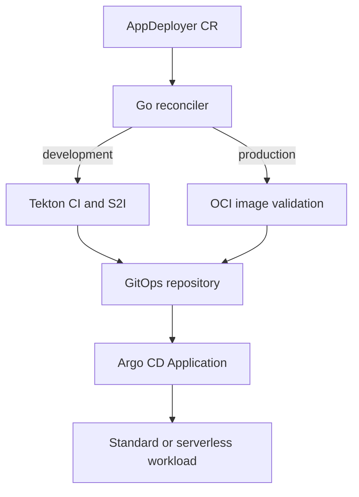

# Open Ecosystem Services

Reference implementation scaffold for **shared identity, consent, audit, catalog, policy and observability services**, derived from the doctoral framework *Adaptive AI-Assisted Orchestration and Semantic Interoperability for Serverless Microservices in Hybrid Open Industry Ecosystems*.

> Status: research scaffold. It uses synthetic examples and is not a production certification or regulatory-compliance claim.

## Architecture

The repository applies a provider-neutral, event-aware architecture with:

- governed API entry and explicit OpenAPI contracts;
- CloudEvents and AsyncAPI for asynchronous interoperability;
- identity, consent, audit, catalog, policy and observability services;
- Saga, CQRS, Outbox/Inbox, idempotency, Circuit Breaker and DLQ where justified;
- OpenTelemetry instrumentation and policy-as-code controls;
- Kubernetes/OpenShift deployment assets without hard-coding one cloud provider.

## Repository layout

| Path | Purpose |
|---|---|
| `contracts/` | OpenAPI, AsyncAPI and CloudEvents schemas |
| `docs/` | Architecture, domain model and ADRs |
| `examples/` | Synthetic requests and events |
| `infrastructure/` | Kubernetes/OpenShift and Helm assets |
| `observability/` | OpenTelemetry configuration |
| `operators/appdeployer/` | S2I, Tekton and Argo CD application-delivery operator |
| `policies/` | Rego policies for baseline governance |
| `services/` | Domain and transversal microservices |
| `tests/` | Contract, integration, resilience and performance tests |

## Quick start

```bash
make validate
make test
```

## Core interoperability envelope

Every request or event should carry `correlation_id`, `causation_id`, `schema_version`, `tenant_id`, purpose and data-classification metadata. Domain data must remain synthetic until an approved privacy and governance process exists.

## Roadmap

1. Implement the first domain service under `services/`.
2. Add executable contract tests.
3. Add a reproducible local event broker profile.
4. Add OpenShift deployment overlays.
5. Validate latency, throughput, error rate, trace coverage and recovery.

## AppDeployer Operator

The [`operators/appdeployer`](operators/appdeployer/) module is an Operator SDK
controller written in Go that automates application delivery with S2I, Tekton and
Argo CD. It runs on upstream Kubernetes or OpenShift and can deploy conventional
workloads as well as Knative/OpenShift Serverless services.

### What AppDeployer manages

An `AppDeployer` Custom Resource is the delivery contract for one application and
environment. It references credentials stored in Kubernetes Secrets and declares:

- the source Git repository and revision;
- the S2I-compatible builder image;
- optional Nexus or JFrog Artifactory configuration;
- optional unit and integration test commands;
- optional SonarQube analysis and Quality Gate enforcement;
- the destination OCI registry image and immutable tag;
- a standard or serverless deployment target; and
- the GitOps repository, Kustomize path and Argo CD destination.

The controller never stores secret values in the Custom Resource or status.

### Delivery behavior

| Environment | Build and validation | GitOps and deployment |
|---|---|---|
| `development` | Creates a Tekton `Pipeline` and an immutable `PipelineRun`. The pipeline clones source, injects dependency configuration, runs enabled tests and SonarQube, creates an S2I build definition, builds with rootless Buildah and pushes the image. | The pipeline updates the image in the selected Kustomize path. The controller creates or updates the Argo CD `Application`. |
| `production` | Never creates Tekton resources. A Kubernetes Job validates that the requested image exists in the OCI registry. | A promotion Job updates the production Kustomize path, then the controller creates or updates the Argo CD `Application`. |

Changing `spec.registry.tag` creates a new generation-specific execution. Repeated
reconciliation of the same generation is idempotent.



### Deployment targets

| `spec.deployment.type` | Result |
|---|---|
| `standard` | Argo CD synchronizes a Kubernetes/OpenShift `Deployment`, `Service` and any Route or Ingress declared in GitOps. |
| `serverless` | Argo CD synchronizes a Knative `Service`. AppDeployer also updates scale-to-zero, min/max scale, autoscaling metric and target, concurrency, timeout and route visibility. |

Serverless images must listen on the injected `PORT`, remain stateless and tolerate
rapid scale-out, scale-to-zero and termination.

### Prerequisites

Choose the platform stack before installing AppDeployer:

| Capability | Kubernetes | OpenShift |
|---|---|---|
| CI | Tekton Pipelines | Red Hat OpenShift Pipelines |
| CD | Argo CD | Red Hat OpenShift GitOps |
| Serverless, optional | Knative Serving | Red Hat OpenShift Serverless |
| CLI | `kubectl` | `oc` |

The administrator workstation also needs Git, Go 1.24+, Kustomize and Podman or
Docker. The cluster needs outbound access to Git, artifact, SonarQube and registry
endpoints, plus storage and compute capacity for Tekton build pods.

### Build and install AppDeployer

Clone the repository, select the operator module and publish the controller image
to a registry accessible from the target cluster:

```bash
git clone https://github.com/Open-Industries/open-ecosystem-services.git
cd open-ecosystem-services/operators/appdeployer

export APPDEPLOYER_IMAGE=quay.io/your-org/appdeployer-operator:0.2.0

make test
make docker-build IMG="$APPDEPLOYER_IMAGE"
make docker-push IMG="$APPDEPLOYER_IMAGE"
make install
make deploy IMG="$APPDEPLOYER_IMAGE"
```

For OpenShift, use `oc` and Podman explicitly when needed:

```bash
make docker-build IMG="$APPDEPLOYER_IMAGE" CONTAINER_TOOL=podman
make docker-push IMG="$APPDEPLOYER_IMAGE" CONTAINER_TOOL=podman
make install KUBECTL=oc
make deploy IMG="$APPDEPLOYER_IMAGE" KUBECTL=oc
```

Verify the controller and CRD:

```bash
kubectl rollout status deployment/appdeployer-controller-manager \
  --namespace appdeployer-system --timeout=3m
kubectl get crd appdeployers.platform.openindustries.org
```

Use `oc` instead of `kubectl` on OpenShift. Complete platform-specific procedures
are available here:

- [Kubernetes installation and usage](operators/appdeployer/docs/kubernetes-deployment.md)
- [OpenShift installation and usage](operators/appdeployer/docs/openshift-deployment.md)

### Prepare credentials

Create credentials in every namespace that contains an `AppDeployer`. The
recommended minimum set for a development delivery is:

```bash
kubectl create namespace orders-dev

kubectl create secret docker-registry registry-push-credentials \
  --namespace orders-dev \
  --docker-server=quay.io \
  --docker-username="$REGISTRY_USERNAME" \
  --docker-password="$REGISTRY_PASSWORD"

kubectl create secret generic gitops-credentials \
  --namespace orders-dev \
  --from-literal=username="$GIT_USERNAME" \
  --from-literal=password="$GIT_TOKEN"
```

Additional integrations use these keys:

| Integration | Secret format |
|---|---|
| Private source Git | `username`, `password` |
| SonarQube | `token` |
| Maven settings | `settings.xml` |
| Nexus/Artifactory | Environment-variable keys required by the selected build |
| OCI registry | `kubernetes.io/dockerconfigjson` |

Private GitOps repositories must also be registered with Argo CD or OpenShift
GitOps. AppDeployer does not copy application-namespace credentials into the Argo
CD control-plane namespace.

### Prepare the GitOps repository

The directory selected by `spec.gitOps.path` must contain a `kustomization.yaml`.
Its image name must match `spec.gitOps.kustomizationImage`. Standard deployments
normally reference a `Deployment` and `Service`; serverless deployments reference
a `serving.knative.dev/v1` `Service`.

A reusable serverless Kustomize base is provided in
[`operators/appdeployer/examples/gitops/serverless`](operators/appdeployer/examples/gitops/serverless/).

### Use AppDeployer

Review and customize one of the supplied Custom Resources:

- [Development sample](operators/appdeployer/config/samples/platform_v1alpha1_appdeployer_development.yaml)
- [Production sample](operators/appdeployer/config/samples/platform_v1alpha1_appdeployer_production.yaml)
- [Serverless sample](operators/appdeployer/config/samples/platform_v1alpha1_appdeployer_serverless.yaml)

For a development application, replace all example Git, registry, SonarQube and
namespace values, then apply and observe the resources:

```bash
kubectl apply --filename \
  operators/appdeployer/config/samples/platform_v1alpha1_appdeployer_development.yaml

kubectl get appdeployer --namespace orders-dev --watch
kubectl get pipelines,pipelineruns --namespace orders-dev
kubectl get applications.argoproj.io --all-namespaces
```

For production, reference an image tag already built and present in the registry:

```bash
kubectl create namespace orders-prod
# Create registry-pull-credentials and gitops-credentials in orders-prod.
kubectl apply --filename \
  operators/appdeployer/config/samples/platform_v1alpha1_appdeployer_production.yaml

kubectl get jobs --namespace orders-prod
kubectl get appdeployer orders-api-production \
  --namespace orders-prod --output yaml
```

Production does not clone source, execute tests, run S2I or create Tekton resources.

For a serverless application, install Knative/OpenShift Serverless, prepare the
serverless GitOps base, customize the sample and run:

```bash
kubectl create namespace orders-serverless
# Create registry-push-credentials and gitops-credentials in orders-serverless.
kubectl apply --filename \
  operators/appdeployer/config/samples/platform_v1alpha1_appdeployer_serverless.yaml

kubectl get appdeployer --namespace orders-serverless --watch
kubectl get ksvc,revision,route --namespace orders-serverless
```

On upstream Kubernetes, set `spec.gitOps.argoCDNamespace: argocd`. The OpenShift
samples use `openshift-gitops`.

### Day-2 operations

Promote or rebuild with a new immutable image tag:

```bash
kubectl patch appdeployer orders-api --namespace orders-dev --type merge \
  --patch '{"spec":{"registry":{"tag":"dev-1.0.1"}}}'
```

Inspect controller status and generated resources:

```bash
kubectl get appdeployer orders-api --namespace orders-dev \
  --output jsonpath='{.status.phase}{"\n"}'
kubectl describe appdeployer orders-api --namespace orders-dev
kubectl logs deployment/appdeployer-controller-manager \
  --namespace appdeployer-system
```

Useful status phases include `Building`, `ValidatingImage`, `Promoting`, `Ready`,
`Failed`, `Invalid` and `Error`. The status also records the reconciled generation,
image reference, PipelineRun, GitOps Job and Argo CD Application names.

### Troubleshooting and security boundaries

- If a build fails, describe the generated `PipelineRun` and inspect all task logs.
- If image validation fails, verify the tag and registry pull secret.
- If GitOps promotion fails, verify token write access, repository URL, revision and
  Kustomize path.
- If Argo CD cannot synchronize, register private-repository credentials in Argo CD
  and inspect the generated `Application` conditions.
- If Buildah is rejected, review Kubernetes Pod Security or OpenShift SCC policy for
  the pipeline ServiceAccount. Do not grant cluster-wide privileged access.
- Use least-privileged robot accounts and pin production builder/tool images by
  digest. Never place credentials directly in the Custom Resource.

Detailed design, secret formats and operational boundaries are documented in the
[`AppDeployer module README`](operators/appdeployer/README.md).

## License

Apache-2.0. See [LICENSE](LICENSE).
