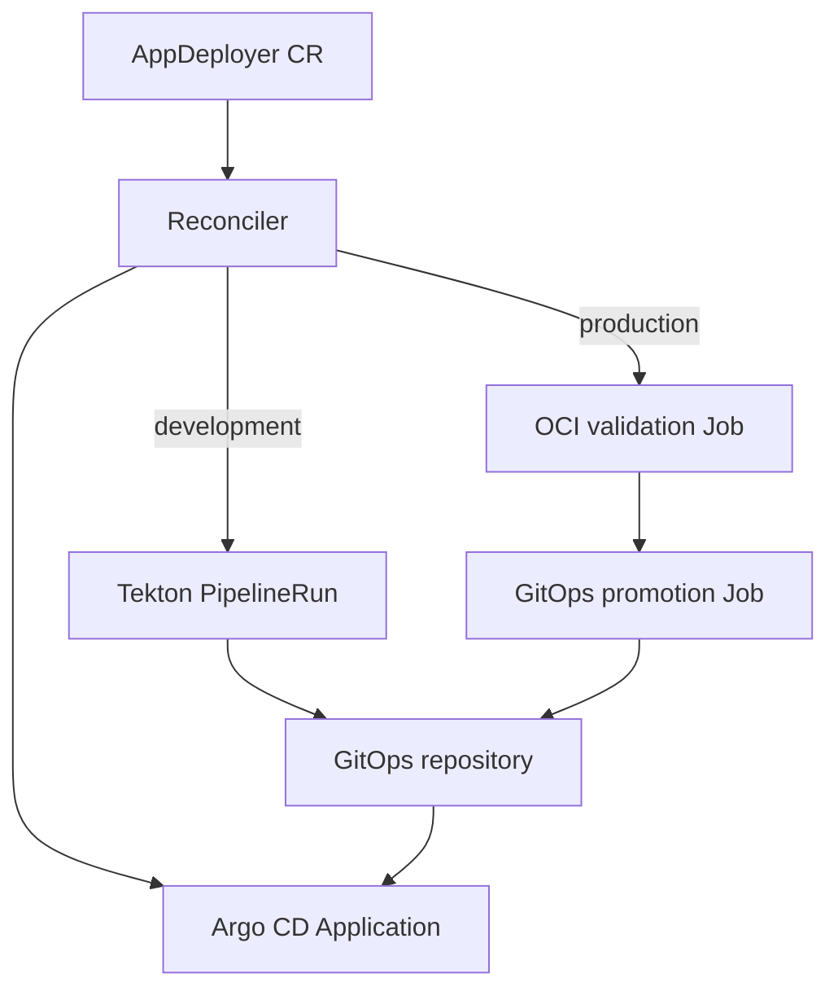

# AppDeployer Operator

AppDeployer is a Go-based Kubernetes Operator SDK project that coordinates S2I, Tekton and Argo CD/OpenShift GitOps. It supports two intentionally different delivery paths:

- `development`: clone, dependency configuration, optional unit tests, optional SonarQube Quality Gate, S2I Dockerfile generation, rootless Buildah build, registry push, optional integration tests, GitOps image update and Argo CD reconciliation.
- `production`: no Tekton resources and no build. The controller validates the requested OCI image with Skopeo, updates the production Kustomize image through a standard Kubernetes Job, and reconciles the Argo CD `Application`.

## Architecture



PipelineRuns and production Jobs include the AppDeployer generation in their name. A specification change therefore creates a new immutable execution while repeated reconciliations remain idempotent.

## Prerequisites

- Kubernetes with Tekton Pipelines and Argo CD, or OpenShift with OpenShift Pipelines and OpenShift GitOps.
- `kubectl` or `oc`, Go 1.24+, `controller-gen`, Kustomize, and Podman/Docker for development.
- A GitOps repository whose selected path contains a `kustomization.yaml`.

The controller expects these Secret shapes in each AppDeployer namespace:

| Integration | Secret keys/type |
|---|---|
| Registry | `kubernetes.io/dockerconfigjson`, mounted as `.dockerconfigjson` |
| Source Git (optional) | `username`, `password` |
| GitOps Git | `username`, `password` |
| SonarQube | `token` |
| Nexus/Artifactory credentials | arbitrary environment-variable keys used by the build |
| Maven settings | `settings.xml` |

Use a least-privileged robot account for registry and Git credentials. Do not place tokens in the Custom Resource.

## Build and install

```bash
make test
make docker-build IMG=quay.io/your-org/appdeployer-operator:0.1.0
make docker-push IMG=quay.io/your-org/appdeployer-operator:0.1.0
make install
make deploy IMG=quay.io/your-org/appdeployer-operator:0.1.0
```

Create the workload namespaces and credentials before applying a sample:

```bash
oc new-project orders-dev
oc create secret docker-registry registry-push-credentials \
  --docker-server=quay.io --docker-username="$QUAY_USER" --docker-password="$QUAY_TOKEN"
oc create secret generic gitops-credentials \
  --from-literal=username="$GIT_USER" --from-literal=password="$GIT_TOKEN"
oc apply -f config/samples/platform_v1alpha1_appdeployer_development.yaml
oc get appdeployers,pipelines.tekton.dev,pipelineruns.tekton.dev -n orders-dev
```

The production sample intentionally omits `source`, `builderImage`, tests and SonarQube. Inspect its progress with:

```bash
oc apply -f config/samples/platform_v1alpha1_appdeployer_production.yaml
oc get appdeployer orders-api-production -n orders-prod -o yaml
oc get jobs -n orders-prod
```

## Important operational boundaries

- Automatic Git writes currently support HTTPS basic/token credentials. SSH credentials can be added as a follow-up provider implementation.
- The selected GitOps path is validated as a safe relative path and must use Kustomize.
- The Argo CD `Application` may live in `openshift-gitops`, so it is labeled for traceability rather than assigned an invalid cross-namespace owner reference.
- Private GitOps repositories must also be registered with Argo CD/OpenShift GitOps; the namespaced Git Secret is used by the update task and is not copied into the Argo CD control-plane namespace.
- S2I/Buildah permissions depend on the cluster's Pod Security or OpenShift SCC policy. Review them before production use.
- Floating tool image tags are convenient for this scaffold; production releases should pin every tool and builder image by digest.
